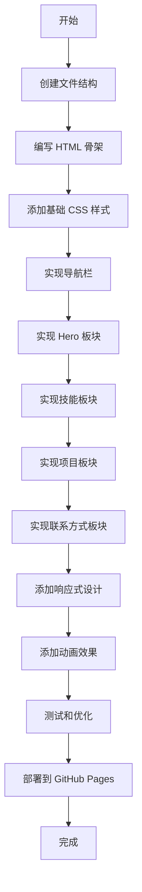

# 个人作品集/简历页面 - 实施计划

## 项目概述

**目标**: 替换现有的简单首页，创建一个现代简约风格的个人作品集/简历页面

**技术栈**: 纯 HTML/CSS/JavaScript（轻量、快速加载）

**内容板块**:
1. 个人介绍 (Hero Section)
2. 技能展示 (Skills)
3. 项目作品 (Projects)
4. 联系方式 (Contact)

---

## 页面结构设计

```
┌─────────────────────────────────────────────────────────┐
│                    导航栏 (Navigation)                    │
│  Logo/名字    个人介绍 | 技能 | 项目 | 联系方式           │
├─────────────────────────────────────────────────────────┤
│                                                         │
│                  个人介绍 (Hero Section)                 │
│                                                         │
│     头像/照片        姓名                                │
│                     职位/头衔                            │
│                     简短自我介绍                         │
│                     社交链接 (GitHub, LinkedIn等)        │
│                                                         │
├─────────────────────────────────────────────────────────┤
│                                                         │
│                    技能展示 (Skills)                     │
│                                                         │
│   ┌─────────┐  ┌─────────┐  ┌─────────┐               │
│   │ 前端技术 │  │ 后端技术 │  │ 工具/其他│               │
│   │ Vue.js  │  │ Node.js │  │  Git    │               │
│   │ React   │  │ Python  │  │ Docker  │               │
│   │ ...     │  │ ...     │  │ ...     │               │
│   └─────────┘  └─────────┘  └─────────┘               │
│                                                         │
├─────────────────────────────────────────────────────────┤
│                                                         │
│                   项目作品 (Projects)                    │
│                                                         │
│   ┌─────────────────┐  ┌─────────────────┐            │
│   │ vite-element-   │  │ vue-article-    │            │
│   │ admin           │  │ affix           │            │
│   │ 项目描述...      │  │ 项目描述...      │            │
│   │ [预览] [源码]   │  │ [预览] [源码]   │            │
│   └─────────────────┘  └─────────────────┘            │
│                                                         │
│   ┌─────────────────┐                                  │
│   │ translate-page  │                                  │
│   │ 项目描述...      │                                  │
│   │ [预览] [源码]   │                                  │
│   └─────────────────┘                                  │
│                                                         │
├─────────────────────────────────────────────────────────┤
│                                                         │
│                   联系方式 (Contact)                     │
│                                                         │
│              邮箱: your@email.com                       │
│              GitHub: github.com/11003                   │
│              其他社交链接...                             │
│                                                         │
├─────────────────────────────────────────────────────────┤
│                    页脚 (Footer)                        │
│              © 2024 Sonder. All rights reserved.       │
└─────────────────────────────────────────────────────────┘
```

---

## 文件结构

```
/
├── index.html          # 主页面 (替换现有)
├── css/
│   └── style.css       # 主样式文件
├── js/
│   └── main.js         # 交互脚本
├── images/
│   ├── avatar.jpg      # 头像 (可选)
│   └── projects/       # 项目截图 (可选)
│       ├── vite-element-admin.png
│       ├── vue-article-affix.png
│       └── translate-page.png
└── (现有项目目录保持不变)
    ├── translate-page/
    ├── vite-element-admin/
    └── vue-article-affix/
```

---

## 详细实施步骤

### 第一阶段: 基础结构

#### 1.1 创建 HTML 骨架
- 创建语义化的 HTML5 结构
- 包含所有四个主要板块
- 添加 SEO 相关的 meta 标签
- 添加 Open Graph 标签用于社交分享

#### 1.2 创建 CSS 目录和基础样式
- 创建 `css/style.css`
- 定义 CSS 变量（颜色、字体、间距）
- 添加 CSS Reset/Normalize
- 设置基础排版样式

### 第二阶段: 各板块实现

#### 2.1 导航栏 (Navigation)
**功能**:
- 固定在顶部
- 平滑滚动到各板块
- 移动端汉堡菜单

**样式**:
```css
/* 示例变量 */
:root {
  --primary-color: #2563eb;
  --text-color: #1f2937;
  --bg-color: #ffffff;
  --section-bg: #f9fafb;
}
```

#### 2.2 个人介绍 (Hero Section)
**内容**:
- 头像/照片（圆形或方形带圆角）
- 姓名（大标题）
- 职位/角色（副标题）
- 简短介绍（1-2句话）
- 社交链接图标（GitHub、LinkedIn、Email等）
- 可选：打字机效果展示多个角色

**动画**:
- 淡入效果
- 头像轻微悬浮动画

#### 2.3 技能展示 (Skills)
**布局选项**:
- 选项A: 分类卡片（前端/后端/工具）
- 选项B: 技能标签云
- 选项C: 进度条展示熟练度

**推荐**: 使用技能标签 + 分类的方式，简洁直观

**示例技能分类**:
```
前端: Vue.js, JavaScript, HTML5, CSS3, Element Plus
后端: Node.js, Python (根据实际情况)
工具: Git, Vite, Webpack
```

#### 2.4 项目作品 (Projects)
**展示内容**:
- 项目名称
- 项目描述
- 使用的技术标签
- 预览链接（指向 GitHub Pages 子目录）
- 源码链接（指向 GitHub 仓库）
- 可选：项目截图

**现有项目**:
1. **vite-element-admin**
   - 描述: 基于 Vue 3 + Vite + Element Plus 的后台管理模板
   - 技术: Vue 3, Vite, Element Plus, Vuex, Vue Router
   - 预览: /vite-element-admin
   
2. **vue-article-affix**
   - 描述: Vue.js 文章目录生成插件
   - 技术: Vue.js
   - 预览: /vue-article-affix

3. **translate-page**
   - 描述: 背景跟随鼠标拉扯效果
   - 技术: HTML, CSS, JavaScript
   - 预览: /translate-page

#### 2.5 联系方式 (Contact)
**内容**:
- 邮箱地址
- GitHub 链接
- 其他社交媒体（可选）
- 可选：简单的联系表单

### 第三阶段: 响应式设计

#### 3.1 断点设计
```css
/* 移动端优先 */
/* 默认样式: < 640px */

/* 平板 */
@media (min-width: 640px) { }

/* 小桌面 */
@media (min-width: 768px) { }

/* 桌面 */
@media (min-width: 1024px) { }

/* 大桌面 */
@media (min-width: 1280px) { }
```

#### 3.2 响应式调整
- 导航栏: 桌面水平菜单 → 移动端汉堡菜单
- Hero: 调整字体大小和间距
- 技能: 网格列数调整
- 项目: 卡片从多列变单列
- 整体: 调整内边距和外边距

### 第四阶段: 动画和交互

#### 4.1 CSS 动画
- 页面加载淡入效果
- 滚动时元素渐显（Intersection Observer）
- 悬停效果（按钮、卡片、链接）
- 平滑滚动

#### 4.2 JavaScript 交互
- 导航栏滚动时添加阴影
- 移动端菜单切换
- 滚动到各板块的平滑动画
- 可选：暗色模式切换

### 第五阶段: 优化和测试

#### 5.1 性能优化
- 图片优化（WebP 格式，适当压缩）
- CSS/JS 压缩（可选，GitHub Pages 会处理）
- 字体优化（使用系统字体或 Google Fonts 子集）

#### 5.2 测试
- 跨浏览器测试（Chrome, Firefox, Safari, Edge）
- 移动端测试
- 可访问性检查（对比度、键盘导航）
- Lighthouse 性能评分

---

## 设计规范

### 颜色方案（现代简约）

```css
:root {
  /* 主色调 */
  --primary: #2563eb;        /* 蓝色 - 链接、按钮 */
  --primary-dark: #1d4ed8;   /* 深蓝 - 悬停状态 */
  
  /* 中性色 */
  --text-primary: #1f2937;   /* 深灰 - 主要文字 */
  --text-secondary: #6b7280; /* 中灰 - 次要文字 */
  --bg-primary: #ffffff;     /* 白色 - 主背景 */
  --bg-secondary: #f9fafb;   /* 浅灰 - 次要背景 */
  --border: #e5e7eb;         /* 边框颜色 */
  
  /* 强调色 */
  --accent-green: #10b981;   /* 绿色 - 成功状态 */
  --accent-orange: #f59e0b;  /* 橙色 - 警告状态 */
}
```

### 字体

```css
:root {
  --font-sans: -apple-system, BlinkMacSystemFont, 'Segoe UI', Roboto, 
               'Helvetica Neue', Arial, 'Noto Sans SC', sans-serif;
  --font-mono: 'SF Mono', Monaco, 'Cascadia Code', 'Roboto Mono', 
               Consolas, monospace;
}
```

### 间距系统

```css
:root {
  --space-1: 0.25rem;  /* 4px */
  --space-2: 0.5rem;   /* 8px */
  --space-3: 0.75rem;  /* 12px */
  --space-4: 1rem;     /* 16px */
  --space-6: 1.5rem;   /* 24px */
  --space-8: 2rem;     /* 32px */
  --space-12: 3rem;    /* 48px */
  --space-16: 4rem;    /* 64px */
}
```

---

## 用户提供的信息 ✅

### 个人介绍
- **名称**: Sonder
- **职位**: 前端开发工程师
- **简介**: 热爱前端开发，专注Vue生态
- **头像**: 暂无（可后续添加）

### 技能列表
- **前端技术**: Vue.js, JavaScript, HTML, CSS, Element Plus, Vite

### 联系方式
- **邮箱**: example@email.com
- **GitHub**: github.com/11003

### 项目信息
使用现有的三个项目：
1. vite-element-admin
2. vue-article-affix
3. translate-page

---

## 实施流程图



---

## 预计产出文件

| 文件 | 描述 |
|------|------|
| `index.html` | 主页面，替换现有首页 |
| `css/style.css` | 所有样式 |
| `js/main.js` | 交互脚本 |
| `images/` | 图片资源目录（可选） |

---

## 下一步行动

1. 确认此计划是否符合您的期望
2. 提供上述"需要用户提供的信息"中的内容
3. 切换到 Code 模式开始实施

如有任何问题或需要调整的地方，请告诉我！
